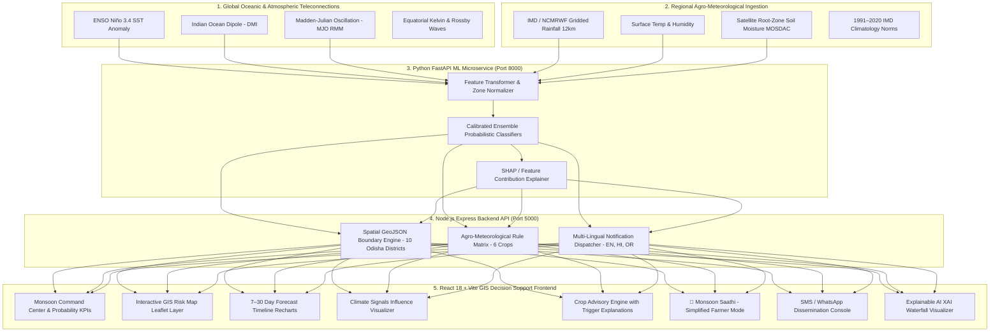

# 🌧️ Hyperlocal Monsoon Onset & Break Prediction System
### *Block/Village Scale AI Decision Support for Climate-Resilient Agriculture*

**Problem Statement:** Hyperlocal Monsoon Onset & Break Prediction System (Block/Village Scale)  
**Organization:** Ministry of Earth Sciences (MoES)  
**Department:** National Centre for Medium Range Weather Forecasting (NCMRWF)  
**Category:** Software | **Theme:** Agriculture, FoodTech & Rural Development  
**Hackathon Target:** Smart India Hackathon (SIH 2026)

---

## 1. Executive Summary & Problem

The Indian Summer Monsoon (Southwest Monsoon) delivers over 70% of India's annual precipitation and dictates the sowing and harvesting cycles of Kharif crops across millions of hectares. However, traditional district-level or regional forecasts lack the **spatial granularity** and **agro-actionability** required by farmers and field officers. 

A district might report normal rainfall on average, while a specific block (e.g., *Rajkanika in Kendrapara*) experiences a devastating **14-day dry spell (break)** during the sensitive seedling emergence phase, resulting in failed germination and severe economic loss.

### The Solution:
A full-stack, AI-powered **Hyperlocal Monsoon Intelligence & Agricultural Decision Support System** that connects:
$$\text{Global Climate Signals (ENSO/IOD/MJO)} \longrightarrow \text{Regional NWP Weather} \longrightarrow \text{AI/ML Prediction} \longrightarrow \text{Hyperlocal Risk} \longrightarrow \text{Farmer Advisory}$$

---

## 2. System Architecture



---

## 3. Technology Stack

| Layer | Technologies |
|---|---|
| **Frontend UI/UX** | React 18, Vite, Tailwind CSS, Lucide Icons, React Router v6 |
| **GIS & Mapping** | Leaflet, React-Leaflet, CartoDB Dark Matter tiles, Dynamic GeoJSON Polygons |
| **Data Visualization** | Recharts (Area charts, Horizontal bar waterfalls, Timeline comparisons) |
| **Backend REST API** | Node.js, Express.js, CORS, Morgan |
| **ML Microservice** | Python 3.13, FastAPI, Uvicorn, Pydantic v2, scikit-learn, NumPy, Pandas |
| **Database Architecture** | MongoDB / Mongoose schemas with portable In-Memory Cache |
| **Localization** | Multi-lingual engine supporting **English**, **Hindi (हिन्दी)**, and **Odia (ଓଡ଼ିଆ)** |

---

## 4. Key Modules & Capabilities

### 1. Monsoon Command Center
- Cascading location selector: **State (Odisha) → District (10 Districts) → Block (e.g., Rajkanika) → Gram Panchayat**.
- Forecast Horizon Toggles: **7 / 14 / 21 / 30 Days**.
- 4 Primary Probabilistic KPI Cards:
  - **Monsoon Onset Probability (%)** (e.g. 76% Favorable)
  - **Break / Dry Spell Risk (%)** (e.g. 68% High Risk)
  - **Heavy Rain Hazard (>65mm) (%)** (e.g. 29% Moderate)
  - **Forecast Model Confidence (%)** (e.g. 81% High Consensus)
- Secondary telemetry: Expected rainfall (mm), Rainfall anomaly (% departure), Topsoil moisture (VWC), Surface temperature (°C).

### 2. Interactive GIS Risk Map
- Map focused on Odisha agro-climatic zones with dynamic block polygon overlays.
- 5 Switchable Geospatial Layers:
  1. **Break / Dry Spell Risk** (Red = Very High $\ge 65\%$, Orange = High $50-65\%$, Yellow = Moderate $30-50\%$, Green = Low $<30\%$)
  2. **Monsoon Onset Progression** (Green = Favorable $\ge 75\%$, Yellow = Moderate, Red = Poor)
  3. **Heavy Rainfall Risk** (Cyan = Inundation Risk $>65\text{mm}$)
  4. **Rainfall Anomaly** (Negative departure deficit zones)
  5. **Topsoil Moisture Deficit** (Root-zone volumetric water content)
- Click-to-inspect block popup and synchronization with the command center.

### 3. 7–30 Day Forecast Progression
- Multi-period forecast timeline chart (Recharts) mapping onset transition, break spell emergence, and monsoon recovery wave.
- 4-horizon progression matrix:
  - **1–7 Days:** 76% Onset, 18% Break, 54 mm Rain
  - **8–14 Days:** 68% Onset, 68% Break (Dry Spell), 38 mm Rain
  - **15–21 Days:** 58% Onset, 52% Break, 29 mm Rain
  - **22–30 Days:** 52% Onset, 32% Break, 42 mm Rain (Recovery)

### 4. Climate Signals Panel
- Real-time gauge metrics for:
  - **ENSO (Niño 3.4 SST Anomaly):** $+0.8^\circ\text{C}$ (Warm Anomaly / El Niño Watch)
  - **Indian Ocean Dipole (IOD):** $-0.4^\circ\text{C}$ (Negative Dipole)
  - **Madden-Julian Oscillation (MJO):** Phase 4 (Maritime Continent / Bay of Bengal, Amp 1.48)
- End-to-end influence visualizer demonstrating how macro teleconnections modulate localized rainfall.

### 5. Crop Advisory Engine
- Supported Crops: **Rice (Paddy)**, **Maize**, **Groundnut**, **Pulses (Arhar/Moong)**, **Vegetables**, **Cotton**.
- 6 Standardized Advisory Types:
  1. *Delay Sowing* (Triggered by high break probability + low soil moisture)
  2. *Proceed with Sowing* (Triggered by high onset probability + steady rainfall continuity)
  3. *Arrange Irrigation* (Triggered by developing dry break spells)
  4. *Prepare Drainage* (Triggered by heavy rainfall >65mm)
  5. *Consider Alternative Crop* (Triggered when rainfall is below crop requirement)
  6. *Monitor Closely* (Triggered by atmospheric transition / low confidence)
- Complete **"Why this recommendation?"** breakdown listing the exact meteorological trigger variables.

### 6. Farmer Mode ("🌾 Monsoon Saathi")
- Mobile-first, high-contrast, distraction-free interface for field farmers.
- 3-Way Instant Localization: **English, Hindi (हिन्दी), Odia (ଓଡ଼ିଆ)**.
- Single-tap Audio Readout (Text-to-Speech simulation) in regional language.
- Emergency Kisan Helpline shortcut (`1800-180-1551`).

### 7. Notification & Dissemination Console
- Block-targeted SMS and WhatsApp broadcast simulation.
- Multi-lingual message drafts in English, Hindi, and Odia.
- Real-time delivery telemetry (Total Subscribers, Delivered, Failed, Retried).

### 8. Explainable AI (XAI)
- Transparent feature attribution (simulated Tree-SHAP surrogate) answering: **"Why does the system predict 68% Break Risk?"**
  - Recent Rainfall Deficit: $+21\%$
  - Temperature Anomaly: $+18\%$
  - Low Soil Moisture: $+14\%$
  - ENSO Teleconnection: $+11\%$
  - Historical Analog Pattern: $+10\%$
  - MJO Phase Modulation: $+8\%$

### 9. Historical Climatology & Trends
- 2021–2026 retrospective validation tracking seasonal rainfall departures, onset shift days, and longest dry spell lengths.

### 10. System Health & Governance
- Subsystem health monitors, latency meters, 06:00 UTC model run stamps, and honest prototype disclosures.

---

## 5. API Endpoints

### Express Backend (`http://localhost:5000/api`)

| Method | Endpoint | Description |
|---|---|---|
| `GET` | `/locations` | List all 10 Odisha districts and block metadata |
| `GET` | `/districts` | List unique districts |
| `GET` | `/blocks/:district` | Get blocks for a selected district |
| `GET` | `/panchayats/:block` | Get gram panchayats for a block |
| `GET` | `/forecast/:locationId?horizon=7` | 7–30 day probabilistic forecast & timeline |
| `GET` | `/climate-signals` | ENSO, IOD, MJO current indices & pipeline |
| `POST` | `/predict` | Calls ML prediction microservice |
| `POST` | `/explain` | Computes feature attribution & SHAP breakdown |
| `GET` | `/crops` | Crop catalog & agronomic requirements |
| `POST` | `/advisory` | Evaluates rules and generates multi-lingual advisory |
| `GET` | `/historical/:locationId` | 2021–2026 historical trends & dry spells |
| `GET` | `/geojson?layer=break_risk` | GeoJSON polygon layers for Odisha map |
| `GET` | `/alerts` | Active officer alerts stream |
| `POST` | `/alerts/acknowledge` | Acknowledge officer alert |
| `GET` | `/notifications/stats` | Delivery analytics & dispatch logs |
| `POST` | `/notifications/send` | Simulate SMS/WhatsApp broadcast |
| `GET` | `/system-status` | Subsystem telemetry & latency diagnostics |

### FastAPI ML Microservice (`http://localhost:8000`)

| Method | Endpoint | Description |
|---|---|---|
| `GET` | `/health` | Model versions and health diagnostics |
| `POST` | `/predict` | Meteorological + Climate feature inference |
| `POST` | `/explain` | Feature contribution decomposition |
| `GET` | `/climate-indices/current` | Teleconnection index monitoring |

---

## 6. How to Run the Prototype

### Prerequisites
- Node.js (v18+)
- Python (3.10+)

### 1. Start Python ML Microservice
```bash
cd ml-service
# (Optional) python -m venv venv && source venv/bin/activate (or venv\Scripts\activate on Windows)
python -m pip install -r requirements.txt
python -m uvicorn main:app --host 0.0.0.0 --port 8000 --reload
```
*Service will run on `http://localhost:8000` (Swagger docs at `http://localhost:8000/docs`).*

### 2. Start Node.js Express Backend
```bash
cd backend
npm install
npm start
```
*Backend API will run on `http://localhost:5000`.*

### 3. Start React Vite Frontend
```bash
cd frontend
npm install
npm run dev
```
*Frontend will open on `http://localhost:3000`.*

---

## 7. 5-Minute Hackathon Demo Script

1. **Landing Overview:** Open `http://localhost:3000/`, showcase the 5-step MoES pipeline from global climate indices to block-level advisories. Click **Open Command Center**.
2. **Command Center:** Highlight default location: **Odisha → Kendrapara → Rajkanika**. Show the 4 primary KPIs: **Onset (76%)**, **Break Risk (68% - High Risk)**, **Confidence (81%)**, and **Expected Rain (112mm)**.
3. **Forecast Horizon:** Toggle horizons between **7 Days**, **14 Days**, **21 Days**, and **30 Days**. Inspect the 4-week progression matrix table.
4. **GIS Risk Map:** Switch to **GIS Risk Map**, toggle layers between *Break Risk*, *Onset*, and *Heavy Rain*. Click on **Rajkanika**, **Mahakalapada**, and **Cuttack** polygons.
5. **Climate Signals:** View **ENSO (+0.8)**, **IOD (-0.4)**, and **MJO Phase 4** influence gauges.
6. **Explainable AI:** Click **"Why this prediction?"** to view the SHAP horizontal feature contribution waterfall (+21% rainfall deficit, +18% temperature anomaly).
7. **Crop Advisory:** Select **Rice**, generate the **"Sowing Caution: Delay Sowing by 5–7 Days"** advisory. Show the trigger variables.
8. **Farmer Mode:** Click **🌾 Farmer Mode**, toggle language to **Odia (ଓଡ଼ିଆ)** and **Hindi (हिन्दी)**. Click **"Listen to Advice"** to demonstrate voice synthesis.
9. **Notification Dispatch:** Open **Notification Center**, click **"Send Broadcast to Rajkanika"** to simulate SMS/WhatsApp delivery to 5,240 farmers.
10. **System Status:** Verify all 7 subsystem health indicators and prototype governance notices.

---

## 8. Important Prototype Limitations & Governance

> [!NOTE]
> - This software is an engineered working demonstration prototype developed for the **Smart India Hackathon (SIH 2026)**.
> - Forecast probabilities, risk indices, and geospatial polygon attributes are generated using calibrated probabilistic simulation models to demonstrate decision workflows.
> - The architecture is fully decoupled such that live NCUM gridded outputs, MOSDAC soil moisture satellite feeds, and IMD AWS station APIs can replace mock layers with zero UI/backend restructuring.

---
**Developed with ❤️ for MoES / NCMRWF • Smart India Hackathon 2026**
