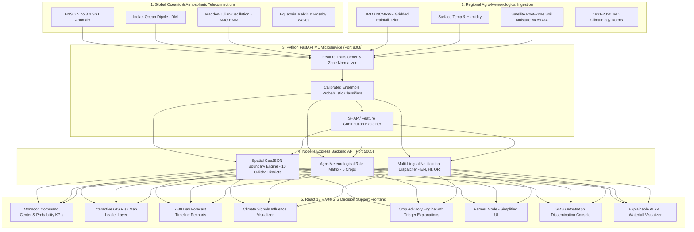

# 🌧️ Hyperlocal Monsoon Onset & Break Prediction System

### *Block / Village Scale AI Decision Support for Climate-Resilient Agriculture*

       

---

## 📌 Problem Statement

> **Hyperlocal Monsoon Onset & Break Prediction System (Block / Village Scale)**

- **Organization:** Ministry of Earth Sciences (MoES)
- **Department:** National Centre for Medium Range Weather Forecasting (NCMRWF)
- **Theme:** Agriculture, FoodTech & Rural Development
- **Target:** **Smart India Hackathon (SIH) 2026**

The Indian Summer Monsoon delivers over **70%** of India's annual rainfall and drives the Kharif sowing and harvesting cycle across millions of hectares. But today, forecasts are largely district-or-region level — far too coarse for a farmer.

A district may report "normal" average rainfall while a single block (e.g. **Rajkanika, Kendrapara**) stares at a devastating **14-day dry spell** during the critical seedling-emergence phase. The result: failed germination, replanting costs, and severe economic loss.

### 💡 Our Solution
A **full-stack, AI-powered hyperlocal monsoon intelligence platform** that connects:

```
Global Climate Signals (ENSO / IOD / MJO)
        → Regional NWP Weather (IMD / NCMRWF)
        → AI/ML Prediction (FastAPI microservice)
        → Hyperlocal Block-Level Risk
        → Farmer Advisory (multi-lingual, multi-channel)
```

---

## ✅ What Has Been Built (Current Status)

| Slab | Description |
|---|---|
| 🖥️ **Frontend** | React 18 + Vite + Tailwind GIS decision-support app with **11 full pages** |
| 🗺️ **GIS Risk Map** | Interactive Leaflet map over **10 Odisha districts** with 5 switchable risk layers |
| 🧮 **Monsoon Command Center** | 4 primary probability KPIs (Onset / Break / Heavy Rain / Confidence), 7–30 day horizon toggles |
| 📈 **Forecast Timeline** | 7 / 14 / 21 / 30 day probabilistic progression charts (Recharts) |
| 🌍 **Climate Signals Panel** | ENSO / IOD / MJO gauges + end-to-end influence visualization |
| 🌾 **Crop Advisory Engine** | 6 crops × 6 advisory types with full "Why this recommendation?" trigger breakdown |
| 👨‍🌾 **Farmer Mode (Monsoon Saathi)** | Mobile-first, high-contrast UI with **English / हिन्दी / ଓଡ଼ିଆ** + text-to-speech voice readout |
| 📢 **Notification Console** | Block-targeted SMS / WhatsApp broadcast simulation with delivery telemetry |
| 🔍 **Explainable AI (XAI)** | SHAP-style waterfall explaining *"Why 68% Break Risk?"* feature-by-feature |
| 📜 **Historical Trends** | 2021–2026 retrospective validation, dry-spell lengths, onset-shift analysis |
| 🩺 **System Health** | Subsystem monitors, latency meters, 06:00 UTC model-run stamps, governance notices |
| 🔧 **Backend API** | Node.js / Express REST API — **22+ endpoints** |
| 🧠 **ML Microservice** | Python FastAPI probabilistic prediction + explainability service |
| 🔤 **Localization Engine** | Multi-lingual engine supporting **English, Hindi, Odia** |

---

## 🏗️ System Architecture



---

## 🧰 Technology Stack

| Layer | Technologies |
|---|---|
| **Frontend UI** | React 18, Vite 5, Tailwind CSS, Lucide Icons, React Router v6 |
| **GIS / Mapping** | Leaflet, React-Leaflet, CartoDB Dark Matter tiles, dynamic GeoJSON polygons |
| **Data Viz** | Recharts (area charts, horizontal bar waterfalls, timeline comparisons) |
| **Backend API** | Node.js, Express.js, CORS, Morgan |
| **ML Microservice** | Python 3.10+, FastAPI, Uvicorn, Pydantic v2, scikit-learn, NumPy, Pandas |
| **Data Layer** | Mongoose-style schemas with portable **In-Memory Cache** (MongoDB-ready) |
| **Localization** | English (EN), Hindi (हिन्दी), Odia (ଓଡ଼ିଆ) |

---

## 📁 Project Structure

```
sih/
└── 86_SIH/
    ├── backend/            # Node.js / Express REST API (port 5005)
    │   ├── controllers/    # Request handlers for all 22+ endpoints
    │   ├── data/           # In-memory datasets (locations, crops, alerts, geojson…)
    │   ├── models/         # MongoDB-compatible Mongoose schemas
    │   ├── routes/         # Express route definitions
    │   ├── services/       # ML service bridge & graceful fallback engine
    │   └── server.js
    ├── frontend/           # React 18 + Vite GIS app (port 3000)
    │   └── src/
    │       ├── components/ # Layout & common UI
    │       ├── context/    # Global app state
    │       ├── pages/      # All 11 feature pages
    │       ├── services/   # API client
    │       └── utils/      # Localization & risk helpers
    ├── ml-service/         # Python FastAPI ML microservice (port 8008)
    │   ├── app/schemas/    # Pydantic request/response models
    │   ├── app/services/   # Predictor & explainer engines
    │   └── main.py
    └── start-all.bat       # One-click launcher for all 3 services
```

---

## 🚀 Getting Started

### Prerequisites
- **Node.js** v18+
- **Python** 3.10+

### ⚡ Quick Start (Windows)
Double-click **`86_SIH/start-all.bat`** — it launches all three services:

| Service | Tech | Port | URL |
|---|---|---|---|
| ML Microservice | FastAPI / Uvicorn | **8008** | http://localhost:8008 `/docs` |
| Backend API | Node.js / Express | **5005** | http://localhost:5005 `/api` |
| Frontend | React / Vite | **3000** | http://localhost:3000 |

### Manual Start

```bash
# 1. Python ML microservice (port 8008 — backend bridge expects this)
cd 86_SIH/ml-service
pip install -r requirements.txt
python -m uvicorn main:app --host 0.0.0.0 --port 8008 --reload

# 2. Node backend API
cd 86_SIH/backend
npm install
npm start

# 3. React frontend
cd 86_SIH/frontend
npm install
npm run dev
```

> If you prefer to run the ML service on another port, set `ML_SERVICE_URL` in the backend environment (defaults to `http://127.0.0.1:8008`).

---

## 🔌 API Overview

### Express Backend — `http://localhost:5005/api`

| Method | Endpoint | Description |
|---|---|---|
| `GET` | `/locations` | All 10 Odisha districts + block metadata |
| `GET` | `/districts` | List of districts |
| `GET` | `/blocks/:district` | Blocks for a district |
| `GET` | `/panchayats/:block` | Gram panchayats for a block |
| `GET` | `/forecast/:locationId?horizon=7` | Probabilistic forecast + timeline (7/14/21/30d) |
| `GET` | `/climate-signals` | ENSO / IOD / MJO indices |
| `POST` | `/predict` | ML prediction (bridges to FastAPI) |
| `POST` | `/explain` | Feature attribution / SHAP breakdown |
| `GET` | `/crops` | Crop catalog & agronomic requirements |
| `POST` | `/advisory` | Multi-lingual crop advisory generation |
| `GET` | `/historical/:locationId` | 2021–2026 trends & dry spells |
| `GET` | `/geojson?layer=break_risk` | GeoJSON polygon layers |
| `GET` | `/alerts` | Officer alerts feed |
| `POST` | `/alerts/acknowledge` | Acknowledge alert |
| `GET` | `/notifications/stats` | Broadcast delivery analytics |
| `POST` | `/notifications/send` | Simulated SMS/WhatsApp dispatch |
| `GET` | `/system-status` | Subsystem telemetry |

### FastAPI ML Microservice — `http://localhost:8008`

| Method | Endpoint | Description |
|---|---|---|
| `GET` | `/health` | Model versions & health |
| `POST` | `/predict` | Meteorological + climate feature inference |
| `POST` | `/explain` | Feature contribution decomposition |
| `GET` | `/climate-indices/current` | Teleconnection index monitoring |

---

## 🧾 What's Implemented vs. Remaining (Current Gaps)

This is an **engineering prototype** for SIH 2026 — the product flows end-to-end, but several parts are simulated or need production hardening. Every gap below is a known, documented item for the next iteration.

| # | Area | ✅ Current State | ⚠️ Remaining Gap / Loop-Hole |
|---|---|---|---|
| 1 | **ML Models** | Deterministic, physics-informed heuristic ensemble (ENSO/IOD/MJO + agro-meteorological rules); graceful fallback engine | No model trained on real IMD/NCMRWF/MOSDAC data; a hardcoded anchor exists for the Rajkanika demo scenario. Needs real training, calibration, and model registry. |
| 2 | **Weather Data** | All datasets are **in-memory / simulated** JSON snapshots with sensible climatology values | No live integration with IMD NCUM grids, IMD AWS station APIs, or MOSDAC satellite soil-moisture feeds. Needs real ingestion & scheduled (06Z) model runs. |
| 3 | **Database** | `Mongoose`-style schemas defined for all entities | No live MongoDB connection yet — data is served from JS data files. Needs Mongo deployment, migrations, and caching. |
| 4 | **GIS Boundaries** | Procedural polygon generation around real block coordinates | Uses pseudo-boundaries, not official GeoJSON shapefiles. Swap in NIC/SoI block & village boundaries. |
| 5 | **Broadcast (SMS/WA)** | Fully simulated delivery console with telemetry | No real gateway (Gupshup/MSG91/Twilio) integration, templates, or delivery webhooks. |
| 6 | **Auth & Roles** | `User` schema defined (Officer/Researcher/Farmer/Admin) | No login, sessions, JWT, or role-based access control implemented. |
| 7 | **Port Config** | Runtime uses **8008 / 5005 / 3000** consistently across code & `start-all.bat` | Earlier README/docs referenced 8000/5000 — environmental config needs to be centralized in `.env` (single source of truth). |
| 8 | **Tests** | None | No unit / integration / E2E test suites for backend, ML, or frontend. |
| 9 | **Repo Hygiene** | Working full-stack codebase | `node_modules`, `dist/`, and `__pycache__` are currently tracked in git; a `.gitignore` is missing and the history should be cleaned. |
| 10 | **Deployment** | Runs locally via `start-all.bat` | No Docker / docker-compose, CI/CD, HTTPS, or cloud hosting setup. |
| 11 | **Security** | CORS open (`*`), no rate limiting | Needs hardened CORS, request validation, rate limiting, and secret management in production. |
| 12 | **Localization** | EN / HI / OR engine live for core flows | Full translation coverage across every page + authentic regional TTS voices still needed. |
| 13 | **External Controls** | Utilities self-contained | Real gateway SDKs, delivery webhooks, live-index polling (ENSO/IOD/MJO), and monitoring/alerting log pipeline pending. |

### 🗺️ Suggested Roadmap (Priority Order)
1. Stand up **real data pipeline** (IMD / NCMRWF / MOSDAC) → replace simulated JSON.
2. **Train & calibrate** ML models on multi-year gridded data; keep SHAP explainability.
3. Connect **MongoDB** and migrate data modules to a proper repository layer.
4. Import **official block/village shapefiles** for accurate GIS mapping.
5. Add **auth (JWT/RBAC)** and connect a **real SMS/WhatsApp gateway**.
6. Containerize with **Docker Compose**, add **CI/CD** and automated **tests**.
7. Clean up the repo (**`.gitignore`**, remove `node_modules`/`dist`/`__pycache__` from history).

---

## ▶️ 5-Minute Demo Script

1. Open `http://localhost:3000/` → showcase the MoES pipeline → **Open Command Center**.
2. Default location: **Odisha → Kendrapara → Rajkanika**. Show KPIs: **Onset 76%**, **Break Risk 68% (High)**, **Confidence 81%**, **Expected Rain 112 mm**.
3. Toggle horizons 7 → 14 → 21 → 30 days and inspect the progression matrix.
4. Open the **GIS Risk Map**, switch layers (*Break Risk / Onset / Heavy Rain*), click **Rajkanika**, **Mahakalapada**, **Cuttack** polygon popups.
5. View **Climate Signals**: ENSO +0.8, IOD −0.4, MJO Phase 4.
6. Click **"Why this prediction?"** → SHAP waterfall (rainfall deficit +21%, temperature +18%).
7. Select **Rice** → generate *"Sowing Caution: Delay Sowing by 5–7 Days"* advisory; show trigger variables.
8. Switch to **🌾 Farmer Mode**, toggle to **Odia / हिन्दी**, tap **"Listen to Advice"** for voice readout.
9. Open **Notification Center** → *Send Broadcast to Rajkanika* (simulated SMS/WhatsApp to 5,240 farmers).
10. Check **System Status** → all subsystem health indicators.

---

## ⚠️ Important Disclaimer

> [!IMPORTANT]
> This software is an **engineered demonstration prototype** built for the **Smart India Hackathon (SIH) 2026**.
> Forecast probabilities, risk indices, and geospatial attributes are generated by **calibrated simulation models** to demonstrate the full decision workflow. They are **not scientifically certified** for real field operations.
> The architecture is deliberately decoupled so that live NCUM gridded outputs, MOSDAC soil-moisture feeds, and IMD AWS APIs can replace the simulated layers **without UI or backend restructuring**.

---

## 📄 License

This project is licensed under the **MIT License** — see the [LICENSE](LICENSE) file for details.

---

**Made with ❤️ for MoES / NCMRWF • Smart India Hackathon 2026**