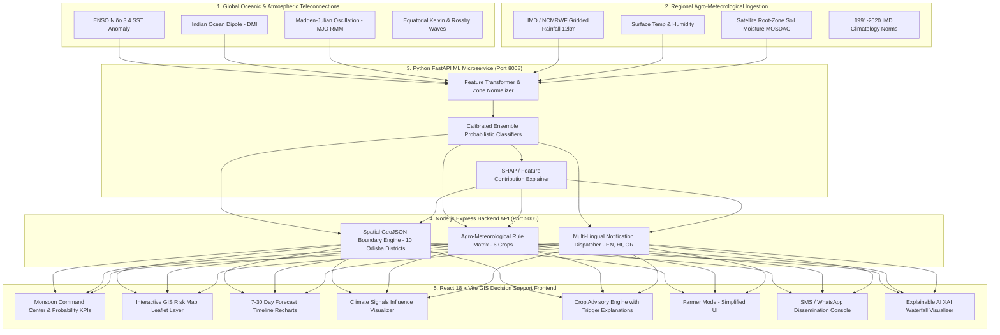

# 🌧️ Hyperlocal Monsoon Onset & Break Prediction System

### *Block / Village Scale AI Decision Support for Climate-Resilient Agriculture*

        

---

## 📖 Table of Contents

1. [Overview](#-overview)
2. [Problem Statement](#-problem-statement)
3. [Why This Project?](#-why-this-project)
4. [Key Features](#-key-features)
5. [Pages & What They Do](#-pages--what-they-do)
6. [System Architecture](#-system-architecture)
7. [Technology Stack](#-technology-stack)
8. [Project Structure](#-project-structure)
9. [Getting Started](#-getting-started)
10. [API Reference](#-api-reference)
11. [5-Minute Demo Script](#-5-minute-demo-script)
12. [Implemented vs. Remaining Gaps](#-implemented-vs-remaining-gaps)
13. [Roadmap](#-roadmap)
14. [Contributing](#-contributing)
15. [Disclaimer](#-important-disclaimer)
16. [License](#-license)

---

## 🔭 Overview

**What is this system?**

The **Hyperlocal Monsoon Onset & Break Prediction System** is a full-stack, AI-powered decision-support platform that delivers **block- and village-level (hyperlocal) monsoon intelligence** for climate-resilient agriculture.

It was purpose-built for the **Smart India Hackathon (SIH) 2026** under the problem statement published by the **Ministry of Earth Sciences (MoES) / National Centre for Medium Range Weather Forecasting (NCMRWF)** in the *Agriculture, FoodTech & Rural Development* theme.

The platform predicts **monsoon onset dates, break/dry-spell windows, and heavy-rain risk** for individual blocks and gram panchayats in **Odisha**, then pushes **multilingual (English / हिन्दी / ଓଡ଼ିଆ) advisories and SMS/WhatsApp alerts** directly to farmers — so that climate intelligence reaches the last mile in a language farmers understand.

```
Global Climate Signals (ENSO / IOD / MJO)
        → Regional NWP Weather (IMD / NCMRWF)
        → AI/ML Prediction (FastAPI microservice)
        → Hyperlocal Block-Level Risk
        → Farmer Advisory (multi-lingual, multi-channel)
```

---

## 🎯 Problem Statement

> **Hyperlocal Monsoon Onset & Break Prediction System (Block / Village Scale)**
>
> — MoES · NCMRWF · SIH 2026

The Indian Summer Monsoon delivers over **70%** of India's annual rainfall and drives the Kharif sowing and harvesting cycle across millions of hectares. Yet today, operational monsoon forecasts are mostly **district- or region-scale** — far too coarse to be useful to a single farmer.

The harsh reality: a district may report *"normal"* average rainfall while a single block (e.g. **Rajkanika, Kendrapara district**) faces a devastating **14-day dry spell** during the critical seedling-emergence phase. The downstream consequences:

- ❌ Failed germination and crop mortality
- ❌ Repeated replanting and wasted seed/input costs
- ❌ Drastic income loss for small & marginal farmers
- ❌ Ineffective, non-localized advisories that don't match ground reality

The gap is clear: **farmers need block-level precision, in their own language, at the right time — not a district-average number.**

---

## 💡 Why This Project?

This platform exists to close the gap between **where weather science happens** and **where farming happens**.

| Reason | What it delivers |
|---|---|
| 🎯 **Hyperlocal precision** | Forecasts at block & panchayat level instead of district averages, so every farmer sees the risk *for their own land* |
| ⏱️ **Actionable lead time** | 7 → 14 → 21 → 30 day probabilistic outlooks for sowing, irrigation, and harvest planning |
| 🌍 **Science-backed signals** | Combines global teleconnections (ENSO, IOD, MJO) with regional agro-meteorology for trustworthy predictions |
| 🗣️ **Last-mile communication** | Multi-lingual advisories with text-to-speech, SMS, and WhatsApp-style broadcast reach |
| 🤝 **Built for the user** | Two interfaces — a powerful **Officer Command Center** for officials and a simplified **Farmer Mode (Monsoon Saathi)** for field use |
| 🔍 **Trust through transparency** | Explainable AI (SHAP-style waterfalls) shows *why* a risk score was assigned, making every advisory auditable |

> **In one line:** *If you are an agricultural officer or a farmer in Odisha, this page tells you — at your block level — when the monsoon will arrive, when the dry spells will hit, when heavy rain is likely, and what to do about it, in a language you speak.*

---

## ✅ Key Features

| Area | Feature |
|---|---|
| 🖥️ **Full-Stack Platform** | React 18 + Vite GIS decision-support frontend, Express REST backend, FastAPI ML microservice |
| 🗺️ **GIS Risk Map** | Interactive Leaflet map across **10 Odisha districts** with switchable risk layers and live radar overlay |
| 🧮 **Command Center** | 4 primary probability KPIs: *Onset / Break / Heavy Rain / Confidence* with 7–30 day horizon toggles |
| 📈 **Forecast Timeline** | 7 / 14 / 21 / 30 day probabilistic progression charts (Recharts) |
| 🌍 **Climate Signals Panel** | ENSO / IOD / MJO gauges with end-to-end influence visualization |
| 🌾 **Crop Advisory Engine** | 6 crops × 6 advisory types, each with a *"Why this recommendation?"* trigger breakdown |
| 👨‍🌾 **Farmer Mode (Monsoon Saathi)** | Mobile-first, high-contrast UI in **EN / हिन्दी / ଓଡ଼ିଆ** with voice readout |
| 📢 **Notification Console** | Block-targeted SMS / WhatsApp broadcast simulation with delivery telemetry & live SSE alert stream |
| 🔍 **Explainable AI (XAI)** | SHAP-style waterfall answering *"Why 68% Break Risk?"* feature-by-feature |
| 📜 **Historical Trends** | 2021–2026 retrospective validation, dry-spell lengths, onset-shift analysis |
| 🩺 **System Health** | Subsystem monitors, latency meters, model-run stamps, governance notices |
| 🧠 **ML Microservice** | Python FastAPI probabilistic prediction + explainability service |
| 🔤 **Localization Engine** | Full EN / HI / OR translation engine with text-to-speech |

---

## 📄 Pages & What They Do

The frontend ships **13 pages** (tabs), each solving a specific job in the monsoon-decision workflow. Below is *what each page is* and *why we built it*.

### 1. 🏠 Landing Page (`LandingPage.jsx`)
- **What it is:** The public entry point — a hero section with the MoES pipeline and 5-step monsoon intelligence flow.
- **Why we use it:** First impression for judges, officials, and farmers. It explains the entire value chain visually, so a new user understands the platform in under 30 seconds and can navigate to the Command Center.

### 2. 🎛️ Command Center (`CommandCenter.jsx`)
- **What it is:** The officer's KPI dashboard — the "mission control" screen.
- **Why we use it:** A district officer needs an at-a-glance answer for the day's big questions — *When does the monsoon arrive? How bad is the break risk? Is heavy rain coming? How confident are we?* It collates the top 4 probabilities and lets the officer switch horizons (7–30 days) without leaving the screen.

### 3. 🗺️ Risk Map — GIS (`RiskMapPage.jsx`)
- **What it is:** A full-screen interactive Leaflet map of Odisha with block-level markers, color-coded risk polygons, and a live rain-radar overlay.
- **Why we use it:** Spatial awareness. Risk is not uniform — a map lets officers *see* which blocks are red-flags today, click any block/panchayat for its specific numbers, and switch layers (Break Risk / Onset / Heavy Rain) to target interventions precisely.

### 4. 📊 Forecast Page (`ForecastPage.jsx`)
- **What it is:** The probabilistic forecast timeline — 7/14/21/30-day outlook charts plus a risk-matrix table.
- **Why we use it:** Farmers make multi-week decisions (sowing, seed treatment, fertilizer, harvesting). This page turns raw probabilities into a clean time-progression story so users can plan *ahead* rather than react.

### 5. 🌍 Climate Signals (`ClimateSignalsPage.jsx`)
- **What it is:** ENSO (Niño 3.4), IOD (DMI), and MJO phase gauges with influence modeling.
- **Why we use it:** Transparency + science credibility. Block-level weather is driven by global drivers; showing these signals publicly explains *why* the system says what it says, and helps researchers validate the prediction logic.

### 6. 🪨 Soil Scanner (`SoilScannerPage.jsx`)
- **What it is:** AI-assisted soil analysis from a photo upload — generates a soil report and crop recommendations.
- **Why we use it:** Soil health determines what should be sown. Officers and extension workers can quickly assess a field, and the report feeds directly into advisory recommendations for that specific land.

### 7. 🌾 Crop Advisory (`CropAdvisoryPage.jsx`)
- **What it is:** Crop-specific advisory generation (rice, maize, groundnut, pulses, vegetables) fully localized.
- **Why we use it:** Everyone can see a forecast — but farmers need *"what do I do about it?"*. This engine converts risk into actionable steps (e.g. *Sowing Caution: delay 5–7 days*) and explains the trigger variables behind every recommendation.

### 8. 👨‍🌾 Farmer Mode — Monsoon Saathi (`FarmerModePage.jsx`)
- **What it is:** A mobile-first, simplified, high-contrast view designed for the farmer in the field.
- **Why we use it:** The core mission — *last-mile reach*. Big touch targets, plain language, **EN/हिन्दी/ଓଡ଼ିଆ** toggle, and a **Listen to Advice** text-to-speech button remove literacy and language barriers.

### 9. 📢 Notification Center (`NotificationCenterPage.jsx`)
- **What it is:** The SMS/WhatsApp broadcast console — compose, dispatch, and view delivery telemetry for alerts.
- **Why we use it:** A prediction that is never communicated has zero value. Officers use this to push block-targeted broadcast alerts and live-monitor delivery, proving the full alert chain end-to-end.

### 10. 📜 Historical Page (`HistoricalPage.jsx`)
- **What it is:** 2021–2026 climatology charts, dry-spell tables, and onset-shift analysis.
- **Why we use it:** Validation & planning. Seeing what actually happened in past seasons calibrates trust, and long-term patterns help researchers and officials with seasonal sowing calendars.

### 11. 🔬 Explainability — XAI (`ExplainabilityPage.jsx`)
- **What it is:** A SHAP-style waterfall explainer that decomposes any risk score into feature contributions (e.g. *rainfall deficit +21%, temperature +18%*).
- **Why we use it:** Trust through transparency. When a farmer or officer asks *"Why 68% break risk?"*, this page gives a defensible, auditable answer — essential for a system that influences real farming decisions.

### 12. 🩺 System Status (`SystemStatusPage.jsx`)
- **What it is:** Live subsystem health, latency meters, model-run stamps (06:00 UTC), and governance notices.
- **Why we use it:** Operational reliability. Officers and the ops team can confirm every service (ML, backend, weather feed) is healthy before relying on its predictions.

### 13. 🔐 Auth (`AuthPage.jsx`)
- **What it is:** Sign-in / registration with OTP verification and pincode-based auto-location detection.
- **Why we use it:** Role-based access and personalization. A farmer lands directly in their block's view; an officer gets the full dashboard — enabling each actor to see only what's relevant to them.

**Supporting components:** Layout (Navbar / Sidebar), `SpeakButton` (TTS), `RiskBadge`, `WeatherBroadcastBanner` (live SSE alert ticker), and a global `AppContext` that carries location, language, session, and active tab across pages.

> **In short:** Every page exists to answer one question in the decision chain — *When? Where? How bad? What to do? How sure? Who to tell?* — in the right language and at the right screen.

---

## 🏗️ System Architecture



**Data flow in 5 steps:**
1. Global climate teleconnections + regional agro-met data are ingested.
2. The FastAPI ML service computes calibrated probabilistic forecasts and feature explanations.
3. The Express backend enriches them with geospatial boundaries, crop rules, and localized messaging.
4. The React frontend visualizes everything as KPIs, maps, charts, and advisories.
5. Alerts reach farmers via multilingual SMS / WhatsApp broadcasts and live SSE streams.

---

## 🧰 Technology Stack

| Layer | Technologies |
|---|---|
| **Frontend UI** | React 18, Vite 5, Tailwind CSS 3, Lucide Icons, React Router v6 |
| **GIS / Mapping** | Leaflet 1.9, React-Leaflet 4.2, CartoDB Dark Matter tiles, dynamic GeoJSON polygons, RainViewer radar |
| **Data Visualization** | Recharts 2.12 (area charts, waterfall bars, timeline comparisons) |
| **Backend API** | Node.js 18, Express 4.22, CORS, Morgan, dotenv, jsonwebtoken + bcrypt (auth-ready) |
| **ML Microservice** | Python 3.10+, FastAPI, Uvicorn, Pydantic v2, scikit-learn, NumPy, Pandas |
| **Data Layer** | Mongoose-style schemas with portable **In-Memory Cache** (MongoDB-ready) |
| **Localization** | English (EN), Hindi (हिन्दी), Odia (ଓଡ଼ିଆ) + text-to-speech |
| **Live Integrations** | Open-Meteo (nowcast weather), OSM Nominatim (geocoding), postalpincode.in (India Post pincode), SSE real-time alerts |

**Ports:** ML microservice `8008` · Backend API `5005` · Frontend `3000`

---

## 📁 Project Structure

```
sih/
└── SIH/                           # Full-stack monorepo
    ├── start-all.bat              # One-click launcher (all 3 services)
    ├── backend/                   # Node.js / Express REST API (port 5005)
    │   ├── app.js                 # Express app, CORS, /health, route mounting
    │   ├── server.js              # Bootstrap with auto port-fallback
    │   ├── controllers/           # Request handlers for 22+ endpoints
    │   ├── data/                  # In-memory datasets (locations, crops, alerts, geojson…)
    │   ├── models/                # MongoDB-compatible Mongoose schemas
    │   ├── routes/                # Express route definitions
    │   ├── services/              # Alert, broadcast, SMS, ML-bridge, soil-vision engines
    │   └── config/                # DB & Firebase configuration
    ├── frontend/                  # React 18 + Vite GIS app (port 3000)
    │   └── src/
    │       ├── App.jsx            # 13-tab routing
    │       ├── components/        # Layout (Navbar/Sidebar/Footer) & common UI
    │       ├── context/           # Global app state (location, language, session)
    │       ├── pages/             # All 13 feature pages
    │       ├── services/          # API client
    │       ├── utils/             # Localization, risk, TTS, socket helpers
    │       └── config/            # Firebase config
    └── ml-service/                # Python FastAPI ML microservice (port 8008)
        ├── main.py                # Health / predict / explain / nowcast routes
        ├── app/schemas/           # Pydantic request/response models
        └── app/services/          # Predictor, nowcaster, explainer engines
```

---

## 🚀 Getting Started

### Prerequisites
- **Node.js** v18+
- **Python** 3.10+
- *(Optional)* a `.env` in `backend/` with your own API keys — already git-ignored

### ⚡ Quick Start (Windows — one click)
Double-click **`SIH/start-all.bat`** — it launches all three services:

| Service | Tech | Port | URL |
|---|---|---|---|
| ML Microservice | FastAPI / Uvicorn | **8008** | http://localhost:8008 `/docs` |
| Backend API | Node.js / Express | **5005** | http://localhost:5005 `/api` |
| Frontend | React / Vite | **3000** | http://localhost:3000 |

### 🛠️ Manual Start

```bash
# 1. Python ML microservice (port 8008 — backend bridge expects this)
cd SIH/ml-service
pip install -r requirements.txt
python -m uvicorn main:app --host 0.0.0.0 --port 8008 --reload

# 2. Node backend API
cd SIH/backend
npm install
npm start

# 3. React frontend
cd SIH/frontend
npm install
npm run dev
```

> If you prefer to run the ML service on another port, set `ML_SERVICE_URL` in the backend environment (defaults to `http://127.0.0.1:8008`).

---

## 🔌 API Reference

### Express Backend — `http://localhost:5005/api`

| Method | Endpoint | Description |
|---|---|---|
| `GET` | `/locations` | All 10 Odisha districts + block metadata |
| `GET` | `/districts` | List of districts |
| `GET` | `/blocks/:district` | Blocks for a district |
| `GET` | `/panchayats/:block` | Gram panchayats for a block |
| `GET` | `/forecast/:locationId?horizon=7` | Probabilistic forecast + timeline (7/14/21/30d) |
| `GET` | `/climate-signals` | ENSO / IOD / MJO indices |
| `POST` | `/predict` | ML prediction (bridges to FastAPI) |
| `POST` | `/explain` | Feature attribution / SHAP breakdown |
| `GET` | `/crops` | Crop catalog & agronomic requirements |
| `POST` | `/advisory` | Multi-lingual crop advisory generation |
| `GET` | `/historical/:locationId` | 2021–2026 trends & dry spells |
| `GET` | `/geojson?layer=break_risk` | GeoJSON polygon layers |
| `POST` | `/auth/*` | OTP login/register, logout, profile (auth-ready) |
| `GET` | `/alerts` + `/alerts/stream` | Officer alerts feed + live SSE stream |
| `POST` | `/alerts/acknowledge` | Acknowledge alert |
| `GET` | `/notifications/stats` + `/notifications/send` | Broadcast delivery analytics & dispatch |
| `GET` | `/system-status` | Subsystem telemetry |

### FastAPI ML Microservice — `http://localhost:8008`

| Method | Endpoint | Description |
|---|---|---|
| `GET` | `/health` | Model versions & health |
| `POST` | `/predict` | Meteorological + climate feature inference |
| `POST` | `/explain` | Feature contribution decomposition |
| `GET` | `/climate-indices/current` | Teleconnection index monitoring |
| `GET` | `/nowcast` | Live Open-Meteo based nowcast |

---

## ▶️ 5-Minute Demo Script

1. Open `http://localhost:3000/` → showcase the MoES pipeline → **Open Command Center**.
2. Default location: **Odisha → Kendrapara → Rajkanika**. Show KPIs: **Onset 76%**, **Break Risk 68% (High)**, **Confidence 81%**, **Expected Rain 112 mm**.
3. Toggle horizons 7 → 14 → 21 → 30 days and inspect the progression matrix.
4. Open the **GIS Risk Map**, switch layers (*Break Risk / Onset / Heavy Rain*), click **Rajkanika**, **Mahakalapada**, **Cuttack** polygon popups.
5. View **Climate Signals**: ENSO +0.8, IOD −0.4, MJO Phase 4.
6. Click **"Why this prediction?"** → SHAP waterfall (rainfall deficit +21%, temperature +18%).
7. Select **Rice** → generate *"Sowing Caution: Delay Sowing by 5–7 Days"* advisory; show trigger variables.
8. Switch to **🌾 Farmer Mode**, toggle to **Odia / हिन्दी**, tap **"Listen to Advice"** for voice readout.
9. Open **Notification Center** → *Send Broadcast to Rajkanika* (simulated SMS/WhatsApp to 5,240 farmers).
10. Check **System Status** → all subsystem health indicators.

---

## 🧾 Implemented vs. Remaining Gaps

This is an **engineering prototype** for SIH 2026 — the product flows end-to-end, but several parts are simulated or need production hardening. Every gap below is a known, documented item for the next iteration.

| # | Area | ✅ Current State | ⚠️ Remaining Gap |
|---|---|---|---|
| 1 | **ML Models** | Deterministic, physics-informed heuristic ensemble (ENSO/IOD/MJO + agro-met rules); graceful fallback | No model trained on real IMD/NCMRWF/MOSDAC data. Needs real training, calibration, and a model registry. |
| 2 | **Weather Data** | In-memory / simulated JSON snapshots with sensible climatology | No live IMD NCUM grids, AWS station APIs, or MOSDAC satellite feeds. Needs ingestion & scheduled (06Z) model runs. |
| 3 | **Database** | Mongoose-style schemas defined for all entities | No live MongoDB connection — data served from JS files. Needs Mongo deployment, migrations, caching. |
| 4 | **GIS Boundaries** | Procedural polygons around real block coordinates | Uses pseudo-boundaries; swap in NIC/SoI block & village shapefiles. |
| 5 | **Broadcast (SMS/WA)** | Simulated delivery console with telemetry | No real gateway (Gupshup/MSG91/Twilio) integration, templates, or delivery webhooks. |
| 6 | **Auth & Roles** | `User` schema defined (Officer/Researcher/Farmer/Admin) | Full login, sessions, JWT, and role-based access control to be completed. |
| 7 | **Tests** | None | No unit / integration / E2E suites for backend, ML, or frontend. |
| 8 | **Repo Hygiene** | Working full-stack codebase | `node_modules`, `dist/`, `__pycache__` tracked in git; clean the history. |
| 9 | **Deployment** | Runs locally via `start-all.bat` | No Docker / docker-compose, CI/CD, HTTPS, or cloud hosting. |
| 10 | **Security** | CORS open (`*`), no rate limiting | Hardened CORS, request validation, rate limiting, secret management. |
| 11 | **Localization** | EN / HI / OR engine live for core flows | Full translation coverage + authentic regional TTS voices. |
| 12 | **External Controls** | Utilities self-contained | Live-index polling, gateway SDKs, delivery webhooks, monitoring/alerting pipelines. |

---

## 🗺️ Suggested Roadmap (Priority Order)

1. Stand up a **real data pipeline** (IMD / NCMRWF / MOSDAC) → replace simulated JSON.
2. **Train & calibrate** ML models on multi-year gridded data; keep SHAP explainability.
3. Connect **MongoDB** and migrate data modules to a proper repository layer.
4. Import **official block/village shapefiles** for accurate GIS mapping.
5. Add **auth (JWT/RBAC)** and connect **real SMS/WhatsApp gateways**.
6. Containerize with **Docker Compose**, add **CI/CD** and automated **tests**.
7. Clean up the repo (`gitignore`, remove build artifacts from history).

---

## 🤝 Contributing

1. **Fork** this repository.
2. **Create** a feature branch: `git checkout -b feature/your-feature`.
3. **Commit** your changes: `git commit -m "Add your feature"`.
4. **Push** to the branch: `git push origin feature/your-feature`.
5. **Open a Pull Request** describing what you changed and why.

Please ensure changes keep all three services running (`start-all.bat`) and update this README if you alter endpoints, pages, or ports.

---

## ⚠️ Important Disclaimer

> [!IMPORTANT]
> This software is an **engineered demonstration prototype** built for the **Smart India Hackathon (SIH) 2026**.
> Forecast probabilities, risk indices, and geospatial attributes are generated by **calibrated simulation models** to demonstrate the full decision workflow. They are **not scientifically certified** for real field operations.
> The architecture is deliberately decoupled so that live NCUM gridded outputs, MOSDAC soil-moisture feeds, and IMD AWS APIs can replace the simulated layers **without UI or backend restructuring**.

---

## 📄 License

This project is licensed under the **MIT License** — see the [LICENSE](LICENSE) file for details.

---

**Made with ❤️ for MoES / NCMRWF • Smart India Hackathon 2026**